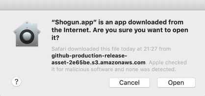

# Shogun
Shogun is a GUI front end for [SDKMAN!](https://sdkman.io).
With Shogun, you can install JDKs, switch between JDKs at ease.

## Supported platform
macOS (tested on Mojave 10.14.5)

## Launch Shogun
Download the latest binary from the [release page](https://github.com/yusuke/shogun/releases/), double-click the app icon to launch.
On macOS Mojave or later, you'll see a dialog from [Gatekeeper](https://support.apple.com/en-us/HT202491) saying nothing malicious was found. Click open to proceed. You won't see the dialog late on.

 
## What does it offer?
Currently you can:
 - See the list of available Java distributions
 - Choose to make a specified distribution / version the default
 - Install or uninstall JDK
 - Reveal the specified JDK Home in Finder
  from OS Task tray.
  
## How to Build 
Java 11 is required to build Shogun. To build Shogun, have Java 11 installed on your mac, and run `$ mvn clean package`
Shogun.app will be located at target/.