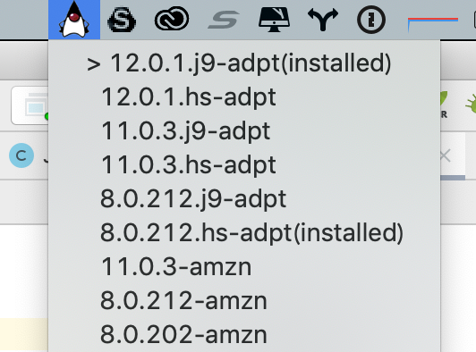

# Shogun
Shogun is a GUI front end for [SDKMAN!](https://sdkman.io).
With Shogun, you can install JDKs, switch between JDKs at ease.

## Launch Shogun
Download the latest binary from the [release page](https://github.com/yusuke/shogun/releases/), and launch from command line:
`$ shogun`.

## What does it offer?
Currently you can:
 - see the list of available Java distributions
 - choose to make a specified distribution / version the default
 
  from OS Task tray.
  
## Build 
Make sure you have [SDKMAN!](https://sdkman.io), and GraalVM 19.x(tested with 19.0.2) installed.
If you don't have native-image comannd installed, type `$ gu install native-image`.
Lastly, you can simply run `mvn package` to compile and create your own native-image.
