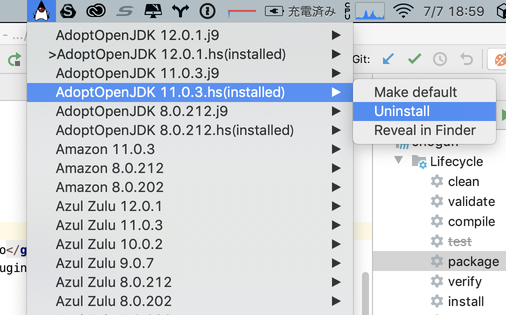
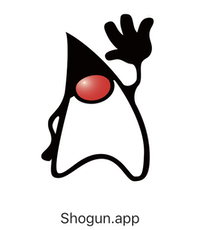

# Shogun
Shogun is a GUI front end for [SDKMAN!](https://sdkman.io).
With Shogun, you can install JDKs, switch between JDKs at ease.

## Supported platform
macOS(tested), Linux

## Launch Shogun
Download the latest binary from the [release page](https://github.com/yusuke/shogun/releases/), and double-click to launch the app.

 
## What does it offer?
Currently you can:
 - see the list of available Java distributions
 - choose to make a specified distribution / version the default
 - install / uninstall JDK
 - Reveal the specified JDK Home in Finder
  from OS Task tray.
  
## How to Build 
 `$ mvn clean package`
